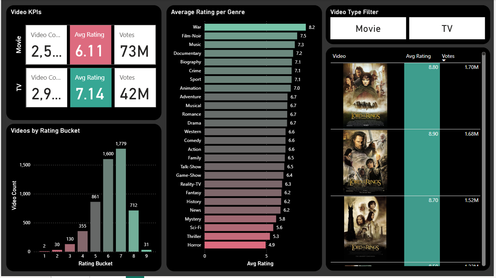
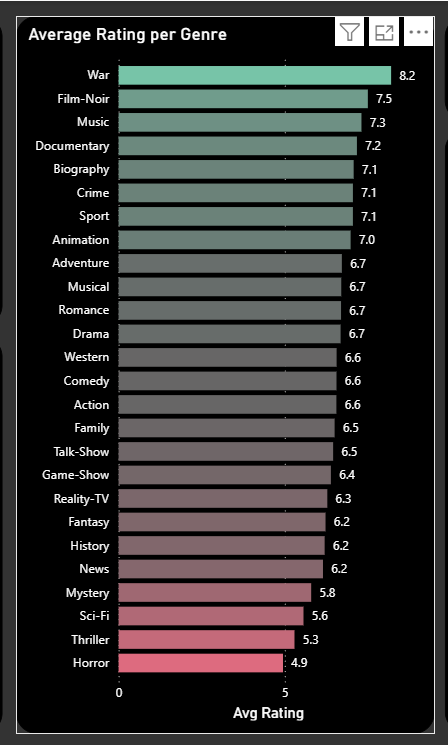
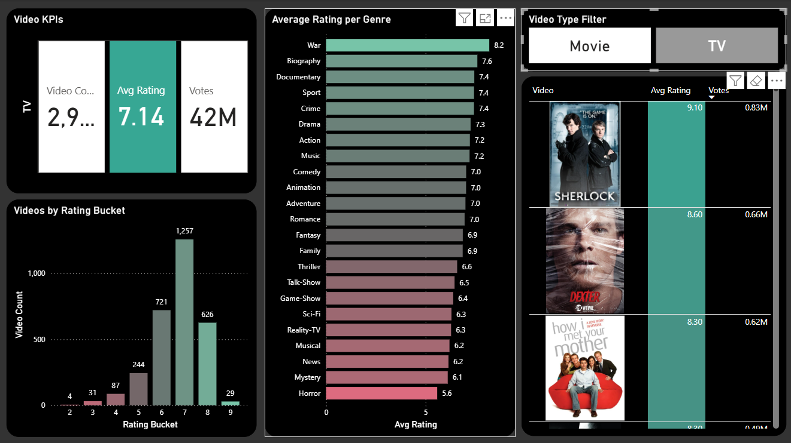
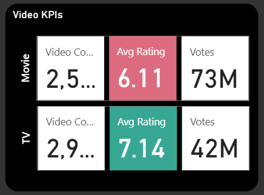
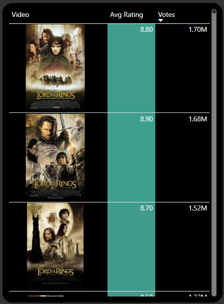

# 🎬 Netflix Power BI Dashboard

An interactive Netflix Analytics Dashboard built in Power BI using IMDb and Netflix datasets to explore ratings, votes, genres, and top-performing content through modern visual storytelling.

---

## 📊 Dashboard Preview



---

## ✨ Features

- Interactive Movie & TV filters
- KPI cards for ratings, votes, and content volume
- Genre-wise rating comparison
- Rating bucket distribution analysis
- Top-rated content table with movie posters
- Modern Netflix-inspired dark theme UI

---

## 📌 Key Visuals

### 🎭 Genre Rating Analysis


### 🎛️ Interactive Filters


### 📈 KPI Section


### 🏆 Top Rated Content


---

## 🛠️ Tools Used

- Power BI
- DAX
- Excel
- Data Modeling
- Interactive Visualizations

---

## 📂 Project Files

```bash
Netflix-dashboard.pbix
Netflix-dataset.xlsx
images/
```

---

## 💡 Insights Generated

- TV Shows show higher average ratings than Movies
- Most titles fall within the 6–8 rating range
- War and Film-Noir genres received the highest ratings
- Interactive filters improve exploratory analysis experience
